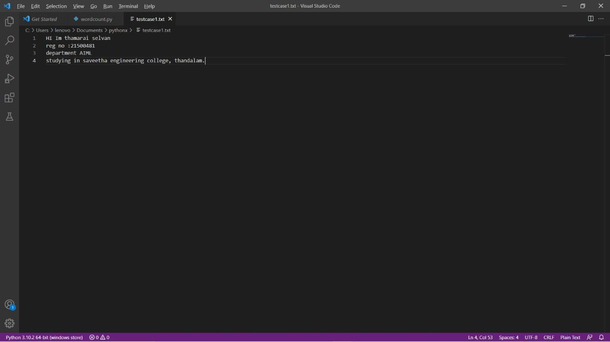
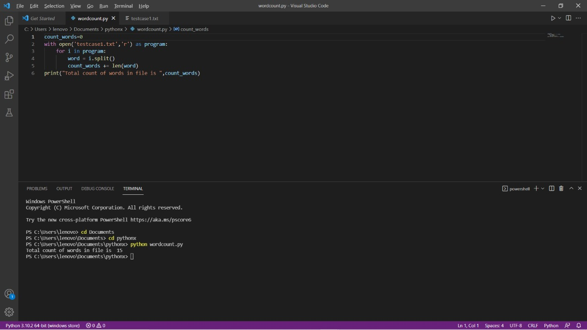

# Word-count
## AIM:
To write a python program for getting the word count from a text.
## EQUIPEMENT'S REQUIRED: 
PC
Anaconda - Python 3.7
## ALGORITHM: 
### Step 1:open visual studio

### Step 2: create file with py extension
 
### Step 3: start the program

### Step 4: write the code 

### Step 5: run terminal forr output of the given program

### Step 6:end the program 

## PROGRAM:
~~~
num_words =0
with open('text.txt','r') as file1:
    for i in file1:
        word =i.split()
        num_words += len(word)
print("Number of words={}".format(num_words))
~~~

### OUTPUT:

## RESULT:
Thus the program is written to find the word count from a text.
